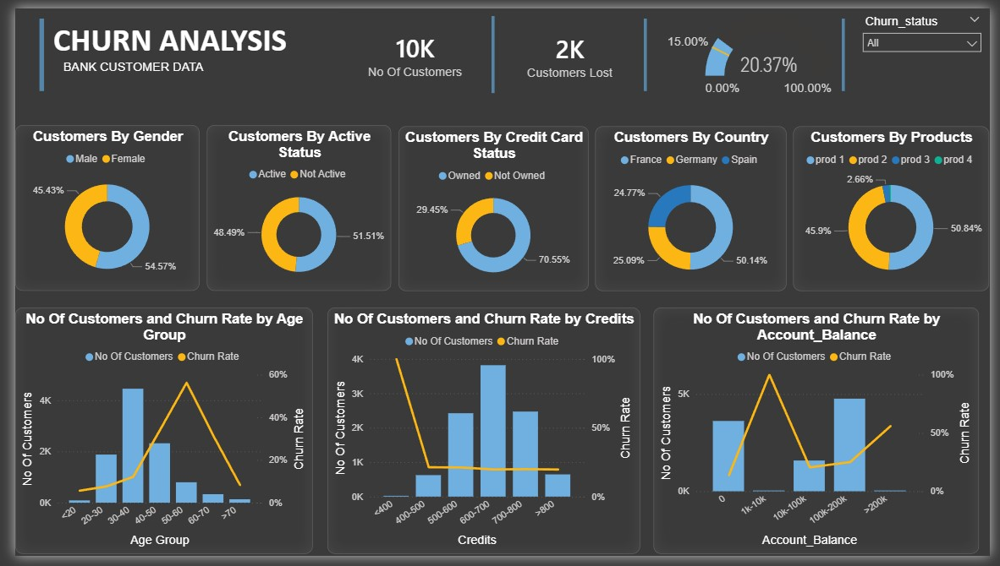

# 📊 Customer Churn Analysis Dashboard

## 📌 Project Overview
This project analyzes bank customer data to identify patterns and factors contributing to customer churn. The goal is to understand customer behavior and provide actionable insights to improve retention and reduce churn.

---

## 🎯 Objectives
- Analyze customer churn patterns across different demographics and behaviors  
- Identify key factors influencing customer attrition  
- Segment customers based on attributes like age, credit score, and account balance  
- Provide insights to support data-driven retention strategies  

---

## 🛠️ Tools & Technologies
- Power BI  
- Power Query (Data Cleaning & Transformation)  
- Excel / CSV Dataset  

---

## 🔄 Data Preparation (ETL Process)

### 🔹 Data Cleaning (Power Query)
- Handled missing and inconsistent values  
- Standardized column formats and data types  
- Removed duplicates and irrelevant fields  

### 🔹 Data Transformation
- Created derived columns for analysis:
  - Age Groups  
  - Credit Score Segments  
  - Account Balance Groups  
- Structured data into analysis-ready format  

---

## 📊 Dashboard Features

### 🔹 Key KPIs
- Total Customers  
- Customers Lost  
- Churn Rate (%)  

---

### 🔹 Customer Distribution Analysis
- Customers by Gender  
- Customers by Active Status  
- Customers by Credit Card Ownership  
- Customers by Country  
- Customers by Number of Products  

---

### 🔹 Churn Analysis (Key Insights)
- Churn Rate by Age Group  
- Churn Rate by Credit Score  
- Churn Rate by Account Balance  

---

## 📈 Key Insights
- Customers in certain age groups show significantly higher churn rates  
- Low credit score segments tend to have higher churn probability  
- Customers with specific account balance ranges exhibit increased churn risk  
- Inactive customers are more likely to churn compared to active users  

---

## 💡 Business Recommendations
- Target high-risk customer segments with personalized retention strategies  
- Improve engagement for inactive customers  
- Offer tailored financial products for customers with lower credit scores  
- Monitor churn trends across age and balance segments to take proactive action  

---

## 📷 Dashboard Preview

---

## 🚀 Conclusion
This project demonstrates how data cleaning, transformation, and visualization can be used to analyze customer churn and generate actionable business insights. The dashboard enables quick identification of high-risk segments and supports better decision-making.

---
