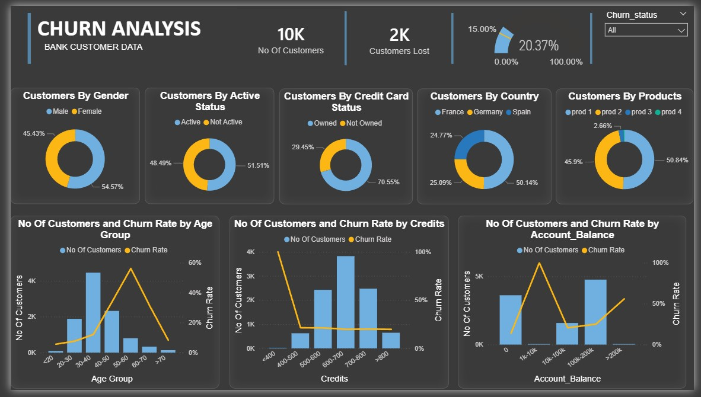

# 📊 Bank Customer Churn — Diagnostic Analysis

A diagnostic analysis of **10,000 bank customers** using **Python, SQL, and Power BI** — 
going beyond *what* the churn rate is to uncover *why* customers leave and *which* segments 
to target for retention.

---

## 🎯 Business Problem
The bank loses **20.37% of its customers**. A churn rate alone doesn't tell you what to do — 
so this project diagnoses the *drivers* of churn and identifies the specific, actionable 
segments the bank should intervene on first.

---

## 📈 Key Findings

- **The "products paradox" (headline finding):** customers with **2 products churn least (7.6%)**, 
  but churn rises sharply beyond that — **1 product = 27.7%**, **3 products = 82.7%**, 
  **4 products = 100%** (small group). Cross-selling a *second* product is the biggest retention 
  lever; over-selling a third or fourth coincides with severe churn.

- **Highest-risk actionable segment:** **inactive, single-product German customers churn at 52.1%** — 
  and there are **720 of them**, making this the largest high-severity group to target first.

- **Geography:** Germany churns **32.4%** vs ~16% for France and Spain.

- **Engagement:** inactive customers churn **26.9%** vs **14.3%** for active members.

- **Non-finding:** credit card ownership has **no effect** (20.8% vs 20.2%) — tested and ruled out.

---

## 🔢 Approach

1. **Descriptive (Power BI):** dashboard with churn KPIs and distribution across demographics.
2. **Diagnostic (Python/Pandas):** compared churners vs non-churners across every dimension; 
   combined factors to isolate high-risk profiles, checking sample sizes to separate real 
   patterns from noise.
3. **SQL validation:** reproduced the key findings in SQL (GROUP BY / HAVING for driver 
   breakdowns, a CTE + window function to rank risk, and a CASE statement for risk tiering) — 
   results matched the Python analysis.

---

## 🧩 Risk Tiers (from SQL)

| Risk Tier | Definition | Churn Rate |
|---|---|---|
| High Risk | 3+ products, or inactive single-product | Highest |
| Medium Risk | Other single-product / mixed profiles | Moderate |
| Low Risk | 2 products | 7.6% |

---

## 💡 Business Recommendations
- **Cross-sell a second product** to single-product customers — the single biggest retention lever (27.7% → 7.6%).
- **Avoid over-selling** — pushing 3+ products coincides with severe churn; the sweet spot is exactly 2.
- **Target the 720 inactive single-product German customers first** — largest high-churn segment.
- **Re-engage inactive members** — engagement alone nearly halves churn.

---

## 🛠️ Tech Stack
**Python** (Pandas) · **SQL** (GROUP BY, HAVING, CTEs, Window Functions, CASE) · 
**Power BI** · **Power Query**

---

## 📂 Repository Files
- `churn_diagnostic.ipynb` — Python diagnostic analysis
- `churn_diagnostic.sql` — SQL reproduction and validation
- `Churn Analysis.pbix` — Power BI dashboard
- `dashboard.jpg` — dashboard preview

---

## 📊 Dashboard Preview

---

## 📌 Data
Bank Customer Churn dataset — 10,000 customers with demographic, account, and activity 
attributes. Available on Kaggle.
